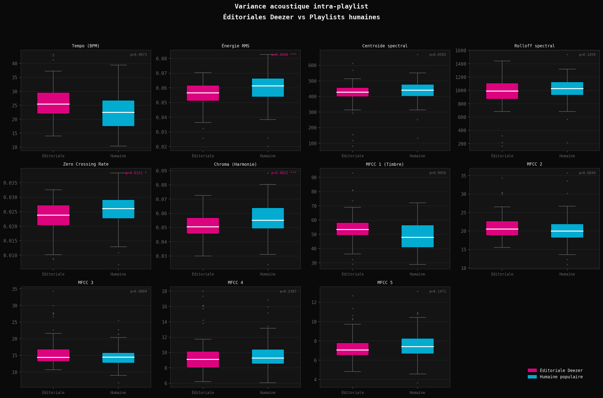
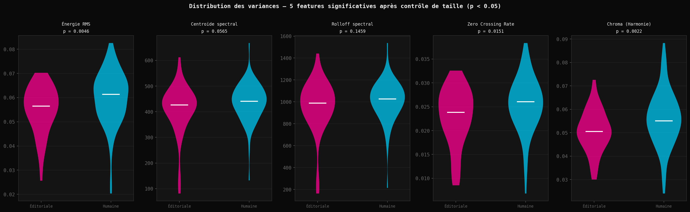
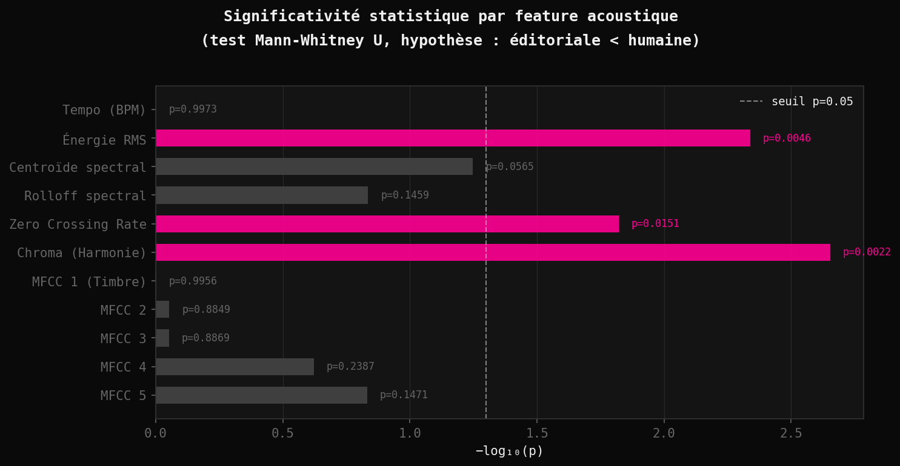
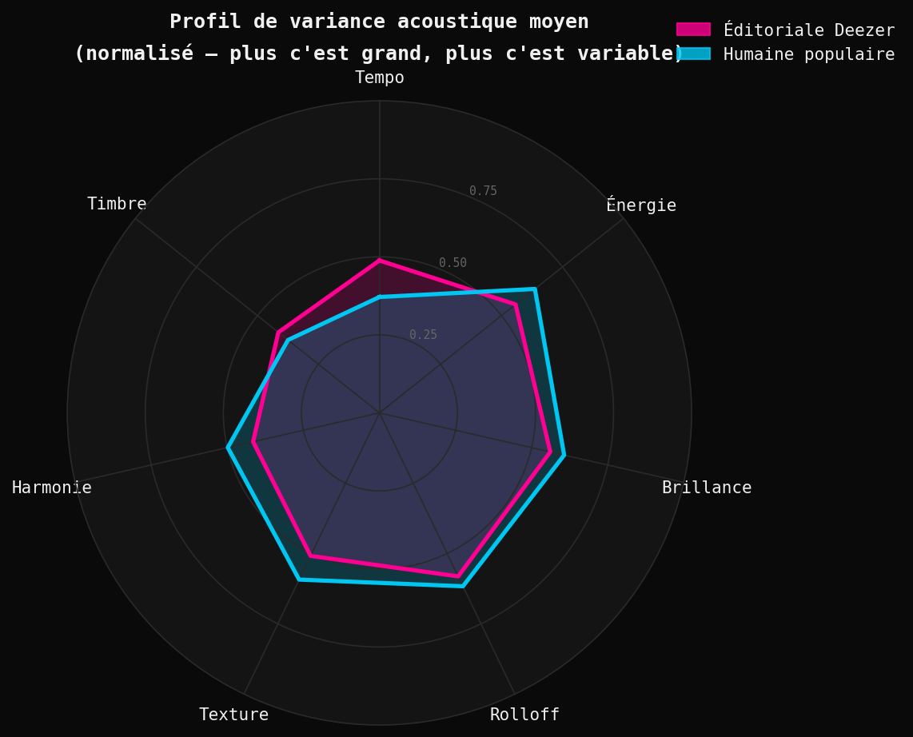
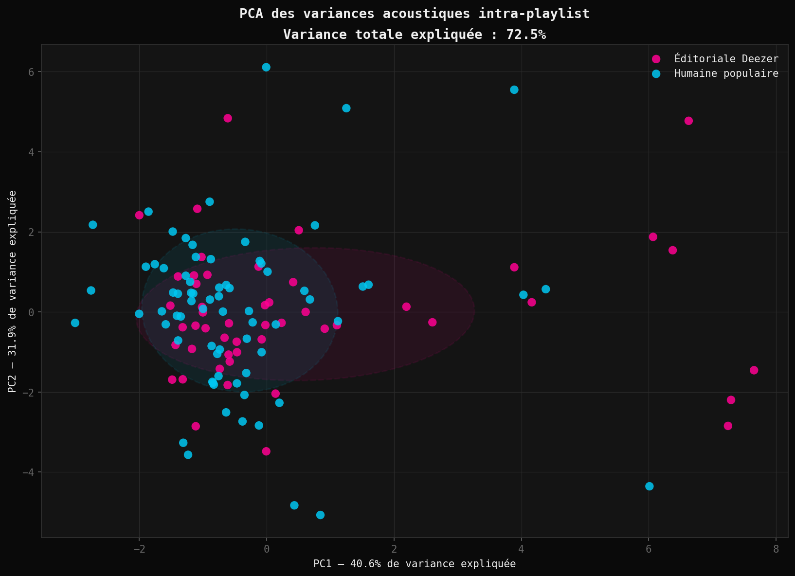
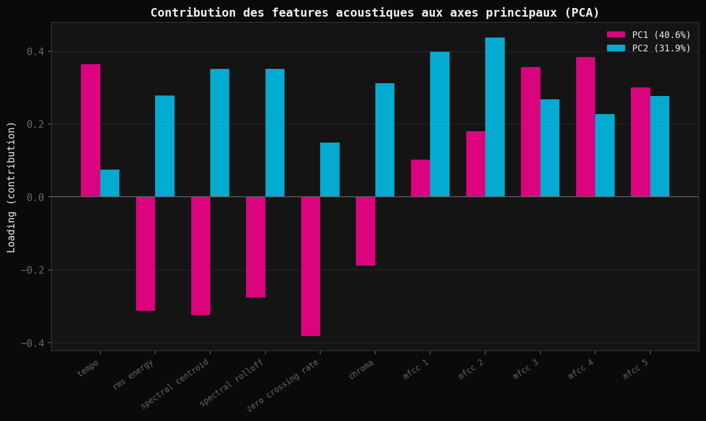

[](https://creativecommons.org/licenses/by/4.0/)


# Deezer Écoute-t-il Pour Vous ?
## Une étude empirique de l'homogénéisation acoustique des playlists éditoriales

> *"Deezer éditorialise son contenu par l'établissement de playlists ainsi que son algorithme Flow."*
> Deezer, documentation officielle

*Étude empirique de l'homogénéisation acoustique des playlists éditoriales Deezer | Python, librosa, SQLite, Mann-Whitney U, PCA*

## Contexte et motivation

En 2007, depuis une cuisine parisienne, Daniel Marhely et Jonathan Benassaya fondent ce qui deviendra Deezer, d'abord sous le nom Blogmusik, avant que des litiges de droits d'auteur ne forcent sa refonte. L'ambition initiale est simple : offrir à quiconque un accès libre, légal et illimité à la musique. Deezer devient ainsi la première plateforme française de streaming musical légal, précédant Spotify de deux ans sur le marché européen.

Dix-huit ans plus tard, la plateforme revendique plus de 120 millions de titres dans son catalogue et une présence dans 180 pays. Ce qui était une promesse de liberté musicale s'est transformé en infrastructure culturelle de premier plan. Et avec toute infrastructure vient une question que l'on pose rarement : **qui décide de ce que vous écoutez, et comment ?**

Les playlists éditoriales, ces sélections conçues et maintenues par les équipes de Deezer, occupent une position stratégique dans cette infrastructure. Elles ne se contentent pas de suggérer de la musique : elles définissent un standard sonore, construisent des habitudes d'écoute, et potentiellement façonnent ce que les producteurs considèrent comme "viable". La question de l'homogénéisation dans le streaming a été largement débattue autour de Spotify, notamment à travers le livre *Spotify Teardown* (Eriksson et al., MIT Press, 2019), qui est devenu une référence académique sur les pratiques de curation algorithmique des plateformes. Deezer, pourtant pionnier français du secteur, a fait l'objet de beaucoup moins d'analyses de ce type.

Cette étude tente de répondre à une question précise : **les playlists éditoriales de Deezer présentent-elles une variance acoustique significativement plus faible que des playlists humaines de popularité comparable ?** Autrement dit, peut-on mesurer une empreinte acoustique propre aux playlists éditoriales Deezer, et si oui, sur quelles dimensions sonores opère-t-elle ?

## Ce que dit la littérature

La question de l'influence des algorithmes sur la diversité musicale intéresse sérieusement les chercheurs depuis le milieu des années 2010. Une étude publiée dans *Réseaux* (Beuscart, Coavoux, Maillard, 2019), conduite à partir de données réelles de 4 000 utilisateurs Deezer suivis sur cinq mois et représentant 8,8 millions d'écoutes, montrait que les utilisateurs qui suivent les recommandations éditoriales de la plateforme sont davantage orientés vers les artistes à succès que ceux qui utilisent la recommandation algorithmique personnalisée. *Réseaux* est l'une des principales revues académiques françaises en sciences de la communication, et cette étude est largement citée dans la littérature sur le streaming musical. En d'autres termes, l'éditorial de Deezer n'est pas neutre en termes de popularité : il a une orientation mesurable.

Manuel Moussallam, directeur de la recherche chez Deezer, soulignait lui-même les difficultés méthodologiques de ce type d'analyse dans un article du CNRS consacré au projet de recherche *Records* (2017) : les résultats dépendent fortement de la façon dont on classifie les genres musicaux, et ces classifications reposent sur des décisions arbitraires. C'est précisément pourquoi cette étude choisit de travailler sur des features acoustiques objectives plutôt que sur des étiquettes de genre.

Ces travaux existants, portant sur les biais éditoriaux en termes de popularité et de genre, n'ont pas exploré la dimension acoustique intrinsèque de la sélection éditoriale. Des études récentes sur la cohérence des playlists utilisateurs (EPJ Data Science, 2025) ont montré que la notion de "transition fluide" entre morceaux est une propriété recherchée par les auditeurs, mais sans comparer playlists éditoriales et humaines sur cette dimension. C'est le vide que cette étude cherche à combler : non plus *qui* est mis en avant, mais *comment ça sonne*.

## Hypothèse

> **Les playlists éditoriales Deezer ont une variance acoustique intra-playlist significativement plus faible que les playlists humaines populaires, indépendamment de la taille des playlists.**

L'hypothèse repose sur le raisonnement suivant : les équipes éditoriales, consciemment ou non, pourraient optimiser pour la continuité d'écoute. On peut supposer que des transitions acoustiques brusques entre morceaux (changements soudains d'énergie, de brillance sonore, de texture) constituent un facteur potentiel de décrochage de l'auditeur. Une curation qui minimise ces contrastes produirait mécaniquement des playlists acoustiquement plus homogènes. Cette hypothèse est cohérente avec ce que les chercheurs appellent le "curatorial turn" dans le streaming : depuis 2013 environ, les plateformes ont progressivement déplacé leur logique éditoriale d'une classification par genre vers une logique de mood et d'état émotionnel cible (Eriksson et al., 2019).

## Méthodologie

### Données collectées

Les données ont été collectées via l'API publique de Deezer, sans recours à aucun endpoint payant ou restreint. La collecte s'est faite en deux groupes distincts :

**Groupe éditorial (50 playlists)** : playlists récupérées via les endpoints `/chart/0/playlists` et `/genre/{id}/charts` de l'API Deezer, qui retournent exclusivement les playlists mises en avant par les équipes éditoriales de la plateforme. 13 genres ont été couverts : pop, hip-hop, rock, électro, R&B, latin, metal, jazz, classique, alternative, reggae, et autres.

**Groupe humain (72 playlists)** : playlists publiques créées par des utilisateurs, récupérées via recherche par mots-clés variés et neutres, filtrées sur un minimum de 1 000 fans et 50 tracks. Les comptes éditoriaux connus (Deezer, Digster, Filtr, Topsify) ont été exclus via une liste noire.

**Volume total** : 122 playlists, 13 580 tracks, 13 564 features acoustiques extraites.

### Extraction des features acoustiques

L'approche centrale de cette étude est l'extraction des features acoustiques directement depuis les previews MP3 de 30 secondes exposées par l'API Deezer, sans recours à un service tiers. Chaque preview a été téléchargée à la volée, analysée via **librosa** (librairie Python d'analyse audio), puis supprimée. Aucune donnée audio n'est stockée.

Les 11 features extraites sont :

| Feature | Ce qu'elle mesure | Exemple concret |
|---|---|---|
| `tempo` | Vitesse du morceau en battements par minute (BPM) | Un morceau lent tourne autour de 70–80 BPM, un morceau dance autour de 120–130 BPM |
| `rms_energy` | Intensité sonore moyenne, le "volume ressenti" | Un morceau acoustique feutré a une énergie faible ; une chanson de club a une énergie élevée |
| `spectral_centroid` | Équilibre entre sons aigus et sons graves | Une cymbale ou une voix sibilante sonnent "brillants" (centroïde élevé) ; une basse profonde sonne "sombre" (centroïde bas) |
| `spectral_rolloff` | Distribution de l'énergie dans les fréquences | Capture la densité et l'agressivité sonore globale d'un morceau |
| `zero_crossing_rate` | Texture sonore | Élevé pour les sons percussifs et bruités (batterie, distorsion) ; bas pour les sons mélodiques et lisses (piano, voix douce) |
| `chroma_mean` | Richesse harmonique et tonale | Élevé pour un morceau harmoniquement riche (gospel, soul) ; bas pour un morceau rythmique ou atonal |
| `mfcc_1` à `mfcc_5` | Timbre, la "couleur" acoustique du morceau | Ce qui permet de distinguer une voix d'une guitare jouant la même note au même volume |

### Calcul de la variance intra-playlist

Pour chaque playlist, l'écart-type de chacune des 11 features a été calculé sur l'ensemble de ses tracks. Concrètement, une variance élevée sur l'énergie signifie que la playlist mélange des morceaux très calmes et des morceaux très intenses ; une variance faible signifie que tous les morceaux ont un niveau d'énergie similaire. Chaque playlist devient ainsi un vecteur de 11 valeurs de dispersion. **L'unité d'analyse est la playlist, pas le track.**

### Tests statistiques

Les comparaisons entre groupes ont été réalisées via le **test de Mann-Whitney U** (non paramétrique, unilatéral, H₁ : éditorial < humain). Ce choix reflète l'impossibilité de supposer la normalité sur des échantillons de 50 et 72 playlists. Une **analyse de robustesse par régression OLS** a ensuite contrôlé l'effet confondant de la taille des playlists : les playlists humaines étant en médiane deux fois plus grandes que les éditoriales (152 vs 66 tracks), une partie de la différence de variance aurait pu être simplement mécanique.

## Résultats

### 1. Tests bruts : Mann-Whitney U

| Feature | p-value | Significatif |
|---|---|---|
| chroma_mean | 0.0022 | ✅ *** |
| rms_energy | 0.0046 | ✅ *** |
| zero_crossing_rate | 0.0151 | ✅ * |
| spectral_centroid | 0.0565 | borderline |
| spectral_rolloff | 0.1459 | non significatif |
| tempo | 0.9973 | effet inversé |
| mfcc 1–5 | > 0.14 | non significatif |

### 2. Après contrôle de la taille : Régression OLS

Une fois la taille des playlists neutralisée, l'effet s'amplifie. **5 features sur 11 sont significativement moins variables dans les playlists éditoriales**, indépendamment du nombre de tracks :

| Feature | β éditorial | p (unilatéral) | Interprétation |
|---|---|---|---|
| rms_energy | −0.0075 | 0.0002 *** | Les éditoriales maintiennent une intensité sonore plus constante |
| zero_crossing_rate | −0.0040 | 0.0004 *** | La texture sonore (percussif vs. lisse) varie moins |
| chroma_mean | −0.0060 | 0.0034 *** | Le contenu harmonique est plus homogène |
| spectral_centroid | −39.71 | 0.0089 *** | L'équilibre aigu/grave est plus stable |
| spectral_rolloff | −71.83 | 0.0438 * | La densité spectrale globale est plus uniforme |

Le tempo (p = 0.9999) et les MFCCs restent non significatifs dans les deux analyses.

### 3. Analyse en composantes principales (PCA)

La PCA sur les vecteurs de variance explique **72.5% de la variance totale** sur deux axes. L'axe PC1 (40.6%) est dominé par les loadings négatifs des 5 features significatives : les playlists éditoriales, concentrées à gauche sur cet axe, minimisent précisément ces dimensions. Les ellipses de confiance des deux groupes se chevauchent partiellement mais sont visuellement distinctes, ce qui indique une séparation réelle sans être parfaite.

## Interprétation

Les résultats soutiennent l'hypothèse, avec une nuance importante : **l'homogénéisation éditoriale de Deezer ne porte pas sur le tempo ni sur le timbre profond, mais sur l'enveloppe sensorielle immédiate des morceaux.**

Les 5 features contraintes forment un groupe cohérent et interprétable. L'énergie RMS et le spectral centroid/rolloff définissent conjointement l'intensité perçue et l'équilibre tonal : si un morceau "frappe fort", "sonne lumineux" ou "pèse lourd". Le zero crossing rate capture la texture (percussif et énergique vs. fluide et mélodique). La chroma capture la richesse harmonique. Ces dimensions correspondent à ce qu'un auditeur ressent dans les premières secondes d'un morceau, avant même d'avoir identifié le genre ou l'artiste.

En revanche, le tempo, auquel on associe intuitivement l'homogénéisation musicale, n'est pas contraint. Les playlists éditoriales Deezer mélangent librement des morceaux lents et rapides. Ce qui ne change pas, c'est leur niveau d'activation sensorielle. L'hypothèse d'une optimisation éditoriale pour la continuité d'écoute est compatible avec ces données : ce n'est pas le style musical qui est normalisé, c'est l'expérience physiologique de l'écoute. Cette interprétation rejoint le "curatorial turn" documenté par Eriksson et al. (2019) : les plateformes ont progressivement déplacé leur logique de curation d'une classification par genre vers une logique de mood et d'état émotionnel cible. Les playlists "Chill", "Focus", "Workout" ne définissent pas un genre : elles définissent un état d'activation, et nos données suggèrent que cet état est acoustiquement contrôlé de façon cohérente dans les playlists éditoriales Deezer.

## Visualisations

*Générés via `visualize.py`.*


**Figure 1 : Boxplots des variances intra-playlist (11 features)**


**Figure 2 : Violin plots des 5 features robustes**


**Figure 3 : Résumé des p-values (−log₁₀)**


**Figure 4 : Profil radar acoustique moyen (normalisé)**


**Figure 5 : PCA des variances intra-playlist**


**Figure 6 : Loadings PCA**


## Limites et points de vigilance

**Sur l'échantillon éditorial.** Les playlists retournées par les endpoints chart de Deezer correspondent aux playlists mises en avant à un instant donné. La saisonnalité et les mises à jour régulières de ces playlists constituent une limite non contrôlée.

**Sur les previews de 30 secondes.** Les features sont extraites sur 30 secondes, soit un échantillon du morceau complet. Pour des features stables dans le temps (tempo, chroma), ce biais est limité. Pour des features dynamiques (énergie, ZCR), l'extrait peut ne pas être représentatif du morceau entier. La portion de preview choisie par Deezer, généralement le refrain, pourrait introduire un biais systématique.

**Sur la causalité.** Cette étude est observationnelle. La différence de variance est réelle et significative, mais elle ne prouve pas que les équipes éditoriales choisissent intentionnellement des morceaux homogènes. Les morceaux populaires pourraient avoir intrinsèquement moins de variance acoustique, et les playlists éditoriales en hériteraient mécaniquement. Cette limite est partiellement adressée par l'analyse de robustesse, mais ne peut être complètement écartée sans dispositif expérimental.

**Sur la comparabilité des groupes.** Les playlists humaines populaires ont souvent été optimisées pour la visibilité. Cela renforce en réalité l'argument principal : si même les playlists humaines populaires sont plus variables acoustiquement que les éditoriales, l'effet éditorial est d'autant plus notable.

## Pistes de recherche complémentaires

**Extension temporelle.** Mesurer l'évolution de la variance acoustique des playlists éditoriales dans le temps permettrait de tester si l'homogénéisation s'est accentuée depuis 2015, en parallèle de l'industrialisation de la curation.

**Comparaison inter-plateformes.** Appliquer la même méthodologie sur Apple Music permettrait de déterminer si cet effet est propre à Deezer ou commun à l'ensemble du streaming éditorial.

**Effet sur la production musicale.** Si les playlists éditoriales créent un corridor acoustique, les producteurs qui ciblent ces playlists adaptent-ils leurs productions en conséquence ? Un suivi des features acoustiques des nouvelles sorties sur plusieurs années permettrait de tester cette hypothèse.

**Granularité par genre.** Contrôler la variable genre dans l'analyse : une playlist électro éditoriale vs. une playlist électro humaine, présentent-elles le même effet ? Cela nécessiterait une classification genre fiable au niveau du track.

**Flow et recommandations personnalisées.** L'algorithme Flow de Deezer est-il plus ou moins homogénéisant que les playlists éditoriales ? Cette comparaison impliquerait un accès aux données personnalisées, hors portée d'une API publique.

## Stack technique

```
Python 3.9
├── requests          # collecte API Deezer
├── sqlite3           # stockage local (deezer_study.db)
├── librosa           # extraction de features acoustiques
├── numpy / pandas    # manipulation de données
├── scipy             # tests de Mann-Whitney U
├── scikit-learn      # PCA
└── matplotlib        # visualisations
```

### Structure du projet

```
deezer-study/
├── create_db.py           # Création du schéma SQLite
├── collect_editorial.py   # Collecte des playlists éditoriales
├── collect_human.py       # Collecte des playlists humaines
├── extract_features.py    # Extraction des features via librosa
├── Analyse.py             # Statistiques descriptives et tests Mann-Whitney
├── robustness.py          # Analyse de robustesse par régression OLS
├── visualize.py           # Génération des 6 visuels
├── deezer_study.db        # Base de données (non versionnée)
└── README.md
```

### Reproduire l'étude

```bash
# Installer les dépendances
pip install requests librosa numpy pandas scipy scikit-learn matplotlib

# Créer la base de données
python create_db.py

# Collecter les playlists (environ 30 minutes)
python collect_editorial.py
python collect_human.py

# Extraire les features acoustiques (environ 3 heures)
python extract_features.py

# Analyses et visualisations
python Analyse.py
python robustness.py
python visualize.py
```

> **Note sur l'accès API.** Cette étude utilise exclusivement des endpoints publics de l'API Deezer, sans authentification. Aucune donnée audio n'est stockée, les fichiers temporaires sont supprimés immédiatement après extraction.

## Références

- Beuscart, J.-S., Coavoux, S., Maillard, S. (2019). *Les algorithmes de recommandation musicale et l'autonomie de l'auditeur. Analyse des écoutes d'un panel d'utilisateurs de streaming*. Réseaux, 213(1), 17-47.
- Eriksson, M., Fleischer, R., Johansson, A., Snickars, P., Vonderau, P. (2019). *Spotify Teardown: Inside the Black Box of Streaming Music*. MIT Press.
- Bonini, T., Magaudda, P. (2024). *Platformed! How Streaming, Algorithms, and Artificial Intelligence Are Shaping Music Culture*. MIT Press.
- Mengjie Xu et al. (2025). *The impact of playlist characteristics on coherence in user-curated music playlists*. EPJ Data Science.
- CNRS Le journal, *Les algorithmes nous poussent-ils à écouter toujours le même style de musique ?* (projet Records, en partenariat avec Deezer).
- Deezer Developer Documentation : [developers.deezer.com](https://developers.deezer.com)

*Étude réalisée par Foulques Arbaretier, mars 2026.*. Les données collectées reflètent l'état des playlists Deezer à cette date.*

